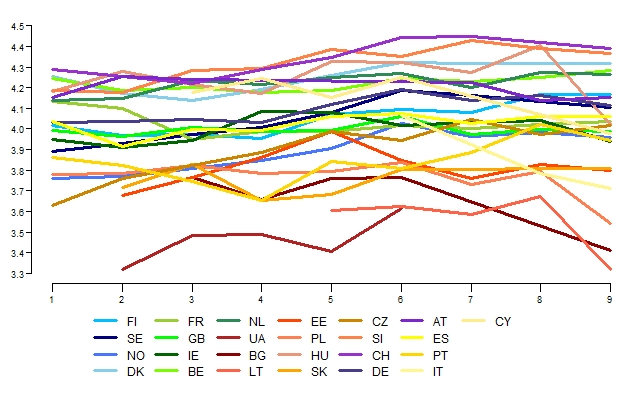
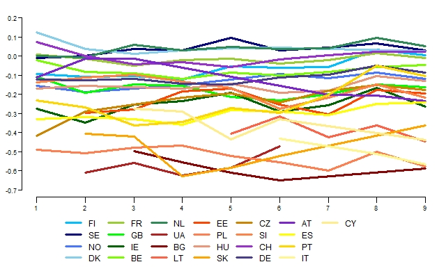
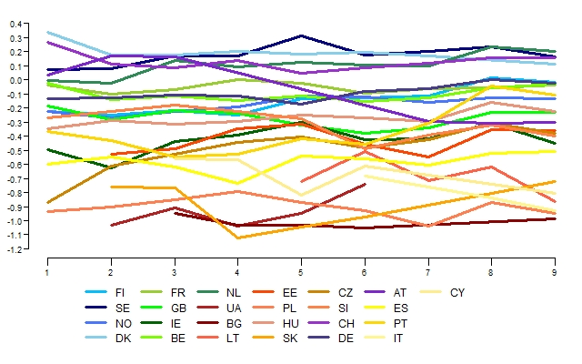
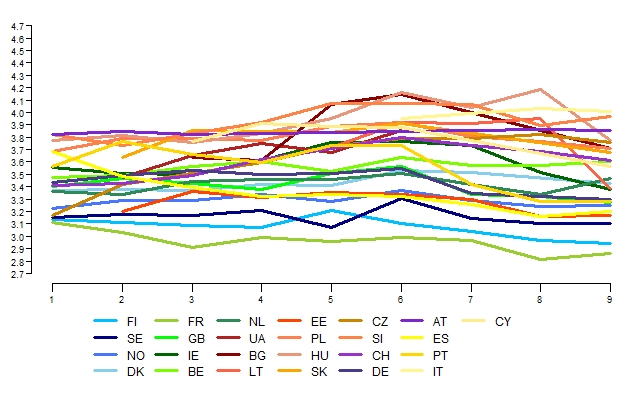
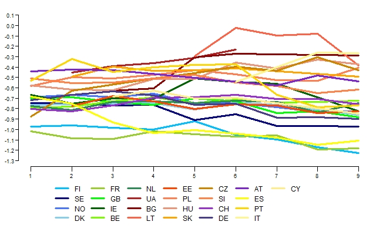
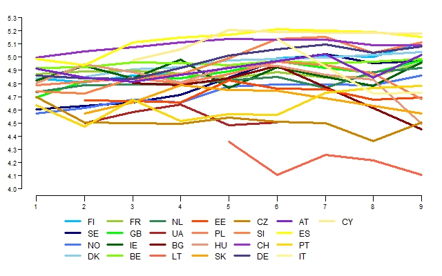
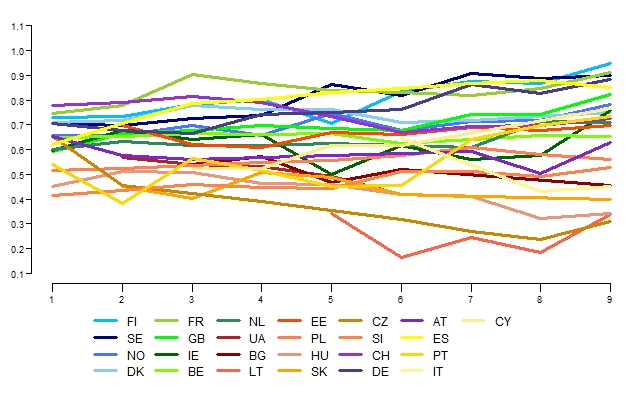
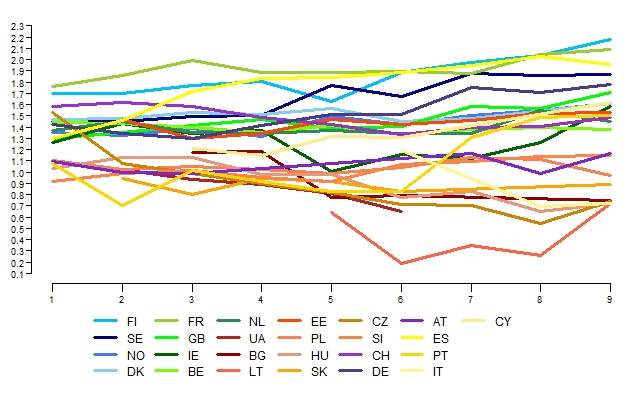

```{r,includ=F}
#save.image(file='tempenv.RData')
load("tempenv.Rdata")

#important code to show

# opendim and selfdim
#opendim 'Max Conservation = -5, Max Openness to change = 5'
#selfdim 'Max Self-enhancement = -5, Max Self-trancendence = 5'.
E$O <- E$OTC - E$CON
E$S <- E$STR - E$SEN


E$POW = rowMeans(E[c("imprich", "iprspot")])
E$ACH = rowMeans(E[c("ipshabt", "ipsuces")])
E$HED = rowMeans(E[c("impfun", "ipgdtim")])
E$STI = rowMeans(E[c("impdiff", "ipadvnt")])
E$SEL  =rowMeans(E[c("ipcrtiv", "impfree")])
E$UNI = rowMeans(E[c("ipeqopt", "ipudrst", "impenv")])
E$BEN = rowMeans(E[c("iphlppl", "iplylfr")])
E$TRA = rowMeans(E[c("ipmodst", "imptrad")])
E$CON = rowMeans(E[c("ipbhprp", "ipfrule")])
E$SEC = rowMeans(E[c("impsafe", "ipstrgv")])

####### ipsatizing
# mrat 
E$mrat <- rowMeans(E[i21],na.rm=T)
#summary(E$mrat)


E$ipOTC <- rowMeans(E[i21otc],na.rm=T) - E$mrat
E$ipCON <- rowMeans(E[i21con],na.rm=T) - E$mrat
E$ipSEN <- rowMeans(E[i21sen],na.rm=T) - E$mrat
E$ipSTR <- rowMeans(E[i21str],na.rm=T) - E$mrat


E$ipPOW = rowMeans(E[c("imprich", "iprspot")]) - E$mrat
E$ipACH = rowMeans(E[c("ipshabt", "ipsuces")]) - E$mrat
E$ipHED = rowMeans(E[c("impfun", "ipgdtim")]) - E$mrat
E$ipSTI = rowMeans(E[c("impdiff", "ipadvnt")]) - E$mrat
E$ipSEL  =rowMeans(E[c("ipcrtiv", "impfree")])- E$mrat
E$ipUNI = rowMeans(E[c("ipeqopt", "ipudrst", "impenv")]) - E$mrat
E$ipBEN = rowMeans(E[c("iphlppl", "iplylfr")]) - E$mrat
E$ipTRA = rowMeans(E[c("ipmodst", "imptrad")]) - E$mrat
E$ipCON = rowMeans(E[c("ipbhprp", "ipfrule")]) - E$mrat
E$ipSEC = rowMeans(E[c("impsafe", "ipstrgv")]) - E$mrat

```


# Reliability measures

## Openness to change
```{r}
knitr::kable(caotc)
```


## Conservation
```{r}
knitr::kable(cacon)
```


## Self-transcendence
```{r}
knitr::kable(castr)
```

## Self-enhancement
```{r}
knitr::kable(casen)
```


# Improved plots
We changed the colors in order to have an impression abouot regional differences.

**Scandinavian:** 
Finland, Sweden, Norway, Denmark 			 blue


**Western europe:** 
France, Ireland, GB, Belgium, Netherlands	green


**East:** Ukraine, Bulgaria, Lithuania, Estonia, Russia			- red


**Central East:** Czechia, Poland, Slovakia, Hungary, Slovenia	- orange


**Central:** Switzerland, Germany, Austria				- lila/purple


**Mediteranean:** - Spain, Portugal, Italy, Greece, Cyprus		- yellow (dark yellow

## Openness to change
### Raw data




### Ipsatized data




## Openness dimension (Openness to change - conservation)




## Self-enhancement
### Raw data




### Ipsatized data




## Self-transcendence


### Raw data




### Ipsatized data



## Self-transcendence vs self-enhancement dimension




